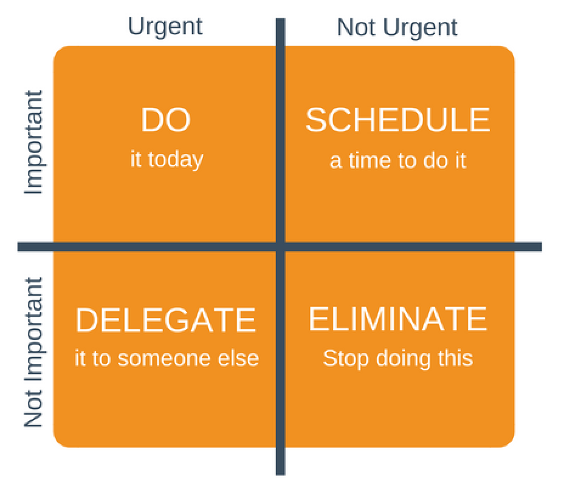

# 두 가지 가치에 대한 이야기
* * *

모든 소프트웨어 시스템은 이해관계자에게 서로 다른 두 가지 가치를 제공하는데, **Behavior(행위)** 와 **Structure(구조)** 이다.

* * *
### Behavior
'행위'라는 가치는 소프트웨어를 고객의 요구사항 문서나 기능 명세서에 따라, 각 요구사항을 충족 시키고 동작하도록 만드는 것이다.

대부분의 프로그래머 즉 개발자는 기능을 개발하는 행위에만 포커스가 되어 자신이 해야하는 일의 전부라고 생각하고 있다고 말하는데,  
저자는 '행위'의 가치에만 집중하는 개발자는 '틀렸다'라고 말하고 있다.

### Structure
'아키텍처'라는 가치는 소프트웨어를 부드럽게 즉 유연하게 만들기 위한 핵심적인 가치이다. 
소프트웨어라는 단어는 soft(부드러운) + ware(제품) 이라는 합성어로, 기게의 행위를 쉽게 변경할 수 있다는 의미로 사용된다.  
소프트웨어가 가진 본연적인 목적을 추구하려면, 기능 명세서가 변경되었을 때 이러한 변경사항을 간단하고 쉽게 바꿀 수 있어야하는데,  
변경사항을 적용하는 데 드는 어려움은 변경되는 범위에 비례해야하며, 변경사항의 형태와는 관련이 없어야된다.

시스템을 구성하는 아키텍처가 특정 형태를 다른 형태보다 선호하면 할 수록 새로운 기능을 개발하는데 어려움있기 때문에,  
아키텍처의 형태는 독립적이어야 보다 더 실용적이다.  

즉, 소프트웨어를 부드럽게 만들기 위한 핵심은 '아키텍처'라고 말하고 있다.

* * *

### 더 높은 가치

그렇다면, 소프트웨어 시스템이 동작하도록 만드는 '행위'의 가치가 중요할까? 아니면 유연한 시스템을 구축하는 '아키텍처'의 가치가 중요할까?

저자는 대부분의 관리자들은 소프트웨어 시스템이 동작하도록 만드는 '행위'의 가치가 중요하다고 말하는데,   
만약 개발자가 같이 이와 같은 주장에 동조한다면 잘못된 태도라고 말하고 있다.

이러한 주장을 뒷받침하기 위해, 아이젠하워 매트릭스를 설명한다.

아이젠하워 매트릭스는 4가지로 분류된다.
1. 긴급하고 중요한
2. 긴급하지는 않지만 중요한
3. 긴급하지만 중요하지 않은
4. 긴급하지도 중요하지도 않은

저자는 행위와 아키텍처의 가치를 아이젠하워 매트릭스를 이용하여, 우선순위를 매긴다.

먼저 행위의 가치는 1, 3번에 해당하고, 아키텍처의 가치는 2번에 해당한다.

대부분의 업무 관리자는 3번째에 위치한 항목을 첫번째로 인식하여, 아키텍처의 중요도를 후순위로 미룬다는 것이다.  
이는 개발자를 딜레마에 빠지게 하는데, 이를 방지하기 위해서는 개발자는 필수로 아키텍처의 중요성을 깨닫고 있어야 할 것 같다.

* * *

### 아키텍처를 위해 투쟁하라

그렇다면, 개발자는 이러한 딜레마에 빠지지 않기 위해서는 어떻게 행동해야할까?

저자는 일하는 모두가 각자의 위치에서 스스로가 믿는 가치를 위해 **투쟁**하라고 말하고 있다.

기업 내 여러 부서에서는 각자 자신의 위치에서 투쟁을 하는데, 개발팀에서는 소프트웨어를 보다 유연하게 만들기 위해 투쟁해야 한다.  
이는 개발자의 역할 중 하나이며, 기업이 당신을 고용한 이유 중 하나라고 서술하고 있다. 만약 이러한 투쟁을 하고 있지 않다면,  
소프트웨어는 점점 하드웨어로 변할 것이고, 결국 확장 가능성이 제로인 볼품없는 시스템이 될 것이다.

* * *

### 개인적인 소감
두 가지 가치에 대한 이야기를 읽으면서 개발에 대한 나의 가치는 대부분 무엇이었을까? 라는 질문을 스스로 던지게 되는 시간이었다.

대학교에서 진행했던 프로젝트들은 대부분 '행위' 가치에만 몰두되었던 것 같아, 반성하는 시간을 가졌다.  
데드라인에 쫒겨 요구사항에 맞게 Api를 개발하고, 프로젝트가 완료되어 학기를 마무리하면 거기서 항상 끝이었다.  
물론 프로젝트가 끝나고, 코드 리팩토링을 통해 클린 코드 및 클린 아키텍처를 만들고 싶은 마음이 있었지만, 실천하지 않았던 경우가 많았다.

로버트 마틴이 주장하는 것처럼, 내가 개발하는 프로젝트가 좋은 아키텍처를 가진 소프트웨어가 될 수 있게 스스로 고민하고  
'아키텍처'의 가치를 잃지 않게 투쟁해야겠다는 생각을 가지게 되었다.

