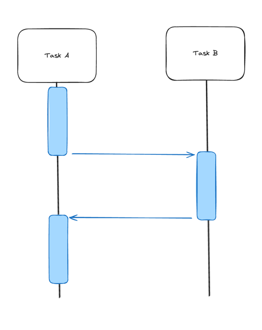
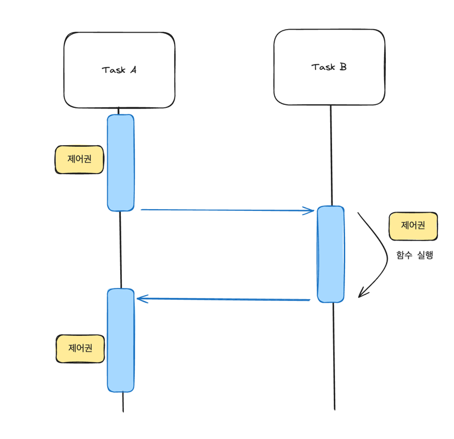

# Sync VS Async / Blocking VS Non-Blocking

> 우리가 동기/비동기, 블로킹/논블로킹을 사용하는 궁극적인 목적은 무엇일까?

어떠한 테스크를 처리하기 위해, 한정된 자원을 효율적으로 사용해 성능 향상을 이끌어내는 것이다.

> 동기/비동기, 블로킹/논블로킹 요점

동기/비동기는 전체적인 작업에 대한 순차적인 흐름에 관심사를 둔다.
블로킹/논블로킹은 전체적인 작업의 흐름 즉 제어권을 줄 것인가, 주지 않을 것인가에 관심사를 둔다.

> Synchronous VS Asynchronous

동기와 비동기를 구분하는 방법은, '요청한 작업에 대해 결과값을 기다리는가?'를 중점으로 구분하면 된다.

예를 들어 작업 A, B가 있다고 가정하겠다.

위와 같은 그림은, Synchronous(동기)이다.  
A라는 작업이 실행되고 있을 때, B 작업을 호출했다면 B 작업이 완료될때까지 A 작업은 응답을 기다리고 있을 것이다.
즉 B 작업이 완료되고, response가 되었을 때 A 작업도 완료할 수 있다.

다음은 Asynchronous(비동기)이다.  
A 작업이 실행되고 있을 때, B 작업을 호출하여도 A는 B의 response를 기다리지 않고 다음 작업을 수행한다.

즉 동기는 요청한 작업에 대해 결과값이 반환된다면 다음 작업을 진행시켜 순서를 지켜서 수행하는 것이고,  
비동기는 요청한 작업에 대해 결과값이 반환되지 않아도 다음 작업을 진행시켜 순서 상관없이 수행되는 것이다.

> Blocking VS Non-Blocking

블로킹과 논블로킹은 '제어권을 넘겼는가, 넘기지 않았는가?'를 중점으로 구분하면 된다.
* 제어권이란 자신의 함수를 실행할 권리와 같은 것으로, 함수가 다 실행되었을 때 자신을 호출한 함수에게 제어권을 반환한다.

  

위와 같은 그림은 Blocking이다.  
A라는 작업이 실행되었을 때, B 작업을 호출하면서 제어권을 넘겨준다. B 작업이 마무리되었을 때 B 작업을 호출했던 A에게
제어권을 반환한다.

  

위와 같은 그림은 non-Blocking이다.  
A라는 작업이 실행되었을 때, B 작업을 호출하지만 제어권을 넘겨주지 않았기 B 작업과 상관없이 계속해서 A 작업을
수행할 수 있다.

(출처 - https://inpa.tistory.com/entry/%F0%9F%91%A9%E2%80%8D%F0%9F%92%BB-%EB%8F%99%EA%B8%B0%EB%B9%84%EB%8F%99%EA%B8%B0-%EB%B8%94%EB%A1%9C%ED%82%B9%EB%85%BC%EB%B8%94%EB%A1%9C%ED%82%B9-%EA%B0%9C%EB%85%90-%EC%A0%95%EB%A6%AC)

우리가 흔히 말하는 동기는 동기 + 블로킹이고, 비동기는 비동기 + 논블로킹 형태이다. 이 글을 정리하면서 동기/비동기, 블로킹/논블로킹의 개념에 대해서 정리해볼 수 있었다.
동기/비동기, 블로킹/논블로킹은 소프트웨어 개발에서 중요한 개념이다. 이들은 각각의 방식에 장단점을 가지고 있으며, 상황에 따라 적절한 방법을 택할 수 있어야한다.
이는 사용자 경험에 직접적인 영향을 미칠 수 있기 때문에, 개발자는 이 개념들을 명확히 이해하고 적절히 활용하여 최적의 성능과 사용성을 제공할 수 있도록 해야 한다.
